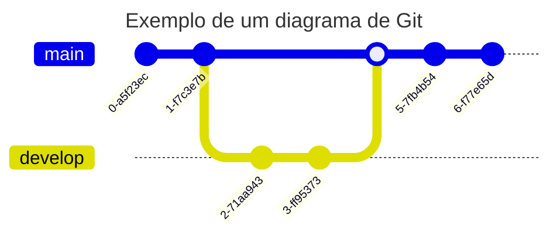

# [Git Braching](https://git-scm.com/book/en/v2/Git-Branching-Branches-in-a-Nutshell)

Uma Branch (Ramificação) nada mais é que abrir um novo fluxo de trabalho para continuar o desenvolvimento sem bagunçar o código que se encontra funcional no momento.

   

