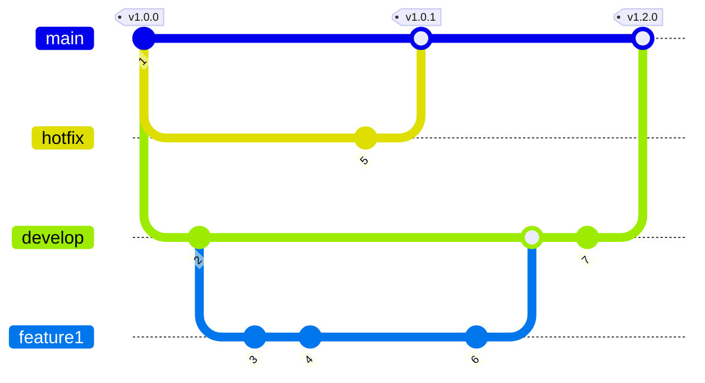

# [GitFlow](https://datasift.github.io/gitflow/IntroducingGitFlow.html)

O GitFlow é uma recomendação de organização de branchs e commits quando se está trabalhando em equipe. Isso ajuda a manter um estado funcional do código, recuperar versões anteriores e ajuda a manter o controle de qual versão será lançada para o usuário final. 

